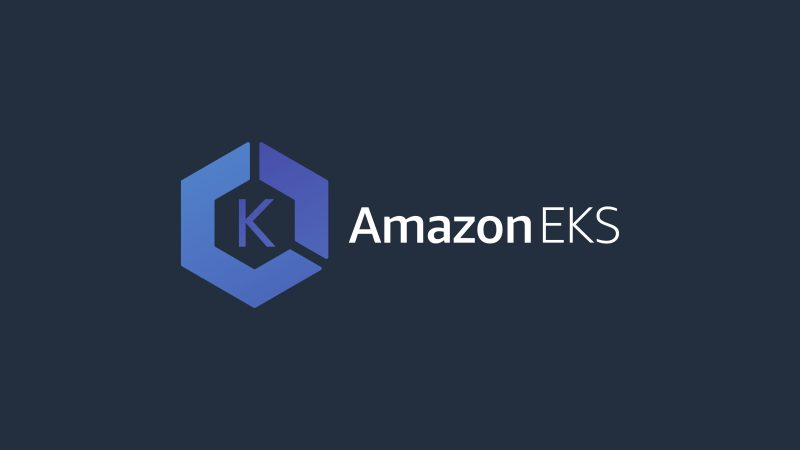
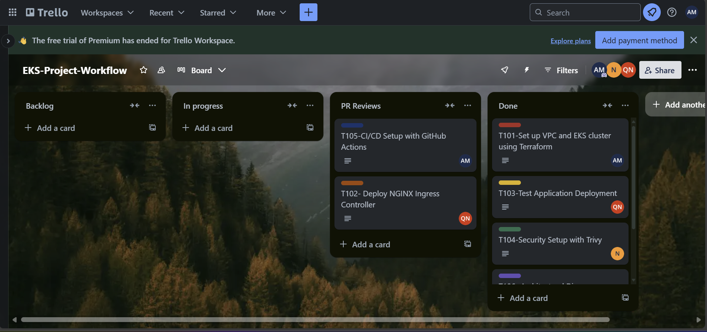

# 2048 Deployment by Team Bravo EKS 🚀 

### This project is a deployment of the classic 2048 game hosted using AWS EKS by Team Bravo.👥🤝

This app is a straightforward yet engaging game where players combine numbered tiles to achieve the elusive 2048 tile through careful planning and strategic movements. 🎮🕹️🧩

## Project Description 📄



This project was undertaken to deploy the 2048 game as a cloud-native application using Amazon EKS (Elastic Kubernetes Service). The primary goal was to demonstrate the scalability, resilience, and efficiency of modern cloud platforms in hosting containerised applications. By leveraging cloud services, we showcased the ability to manage and deploy applications seamlessly in a distributed environment, focusing on performance, reliability, and ease of management.

## Table Of Contents  📑
- [Tech Stack ](#tech-stack)
- [Local App Set Up ](#local-app-set-up)
- [Architectural Diagram](#Architectural-Diagram)
- [Demo](#Demo)
- [trello Board workflow](#trello-board-workflow)
- [Prometheus](#Prometheus)
- [Grafana](#Grafana)
- [ArgoCD](#ArgoCD)
- [Docker Setup](#docker-setup)
- [Dockerfile Explanation](#Dockerfile-Explanation)
- [Contributors ](#contributors)
- [License ](#license)

## Tech Stack 🛠️


### DevOps Tools 🔧

#### These are the tools we used to set up the infrastructure, automate deployments, and manage the applications's lifecycle:
##

| Tool                       | Description                                                                  |
|----------------------------|------------------------------------------------------------------------------|
| 🛠️ **Terraform**            | Infrastructure as Code (IaC) tool for provisioning and managing cloud resources. |
| 📦 **Amazon ECR**           | A fully managed Docker container registry to store and manage images.         |
| ☁️ **Amazon EKS**           | Managed Kubernetes service to deploy and manage containerised applications.    |
| 🐳 **Docker**               | Platform to automate the deployment of applications in containers.            |
| 🧰 **Kubernetes**           | Open-source system for automating the deployment, scaling, and management of containerised applications. |
| 🔄 **CI/CD**                | Continuous Integration and Continuous Deployment pipelines for automation.    |
| 🚀 **ArgoCD**               | GitOps continuous delivery tool for Kubernetes, automating deployments and managing the lifecycle of applications. |
| 🛡️ **Trivy**                | Vulnerability scanner for containers and other artefacts, ensuring security. |
##
### Software Tech Stack 🖥️
 These are the core technologies used to build and run the application itself:

##

| Technology           | Description                                                      |
|----------------------|------------------------------------------------------------------|
| ⚙️ JavaScript         | Programming language for interactivity                          |
| 🎨 CSS               | Styling language for layout and design                          |
| 🖌️ SCSS               | CSS preprocessor for more powerful styling                      |
| 💎 Ruby               | Programming language often used for backend logic               |
| 🌐 HTML               | Markup language for structuring web content                     |
| 🛠️ HCL                | HashiCorp Configuration Language, used for defining infrastructure |


##
## Local App Set Up 🖥️

```
python -m http.server 3000
```
- This command starts a simple HTTP server that serves files from the current directory on port 3000. This is commonly used for local development or testing static websites and applications.

```
http://localhost:3000/
```
- When running the previous command, it allows you to access your app in a browser via http://localhost:3000, serving any files in the current directory or subdirectories. 
  
## Architectural diagram 🖼️📐

## Demo 🎬


## Trello Board Workflow ✅

## Prometheus 🔥

## Grafana 📈

## ArgoCD 🎯   



This Trello board is an EKS Project Workflow designed to manage tasks effectively across different stages of the development process. It features columns for Backlog, In Progress, PR Reviews, and Done, ensuring a clear workflow from task initiation to completion. Each card represents specific tasks, such as setting up EKS clusters, deploying NGINX controllers, or configuring CI/CD pipelines, assigned to team members for collaboration and accountability. The structure supports seamless tracking of progress and prioritization.

## Docker Setup 🐳 

```
 docker build -t 2048-repo . 
```

This command will create a Docker image from the Dockerfile in the current directory (.). The -t flag tags the image with the name "2048-repo", allowing for easy reference in later Docker operations.

## Dockerfile Explanation 📖💡


This Dockerfile is a multistage build designed for a lightweight and efficient deployment of a Python-based application. It uses Python's Alpine image for the building stage, which is minimal in size, and leverages Google's distroless Python image for the runtime stage to reduce attack surface and ensure security.

### Breakdown Of Multi-stage Build ✍️

#### Stage 1: Builder 🔧
```
FROM python:3.11-alpine AS builder
```
- Specifies the base image for the build stage, using Python 3.11's Alpine variant. The AS builder label identifies this stage for referencing later.
```
WORKDIR /app
```
- Sets the working directory inside the container to /app.
```
COPY . .
```
- Copies all files from the project directory on the host to the /app directory in the container.
##
### Stage 2: Runtime 🌐

```
FROM gcr.io/distroless/python3
```
- Sets the base image for the final runtime stage, using a secure, minimal distroless image with Python 3.
```
WORKDIR /app
```
- Establishes /app as the working directory for this stage, matching the builder stage's setup.
```
COPY --from=builder /app /app
```
- Copies the contents of the /app directory from the builder stage into the /app directory of the runtime container.
```
EXPOSE 3000
```
- Declares that the application will use port 3000. This is informative for tools but doesn’t directly affect container behaviour.
```
CMD ["-m", "http.server", "3000"]
```
- Specifies the command to run when the container starts. In this case, it launches a simple HTTP server on port 3000 using Python's built-in module.

##

## Contributors 👥

| Contributor | Role                    |
|-------------|-------------------------|
| Qais  Navaei      | Contributor, DevOps Engineer |
| Abdel Yusuf      | Contributor, DevOps Engineer |
| Najib Mahmoud      | Contributor, DevOps Engineer |
| Aaliyana Adoley Mingle    | Contributor, DevOps Engineer |


## License 📝

Please refer to the app's official owner license [here](./LICENSE.txt).
